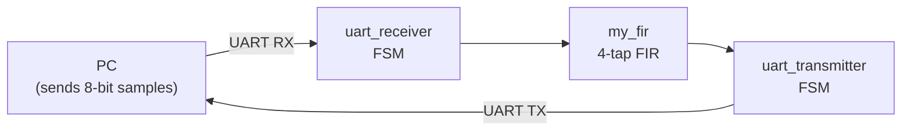

# FPGA Design in VHDL – FIR Filter Co-processor

VHDL code from *Management and Analysis of Physics Datasets*, module A (M.Sc. Physics of Data, University
of Padova, 2023): the lab exercises and the final project, a FIR filter co-processor on an FPGA that
exchanges samples with a PC over UART.

## Final project (`Final_Project/`)

| File | Role |
|---|---|
| `top.vhd` | Top level: connects the receiver, filter and transmitter to the 100 MHz board clock |
| `uart_receiver.vhd`, `uart_transmitter.vhd` | UART state machines converting between the serial line and 8-bit parallel data |
| `sampler_generator.vhd`, `baudrate.vhd` | Baud-rate generators (100 MHz clock divided by 868, about 115 200 baud) with mid-bit sampling |
| `my_fir.vhd` | 4-tap FIR filter: 8-bit signed input samples, 8-bit coefficients, 16-bit products and sums, a D flip-flop delay line, output truncated to 8 bits |
| `DFF.vhd` | D flip-flop used in the delay line |
| `Report.pdf` | Design report |
| `final_exercise.pdf` | Assignment: build the FIR co-processor and compare it with a software implementation |
| `VHDL_generation_of_optimized_FIR_filters.pdf` | Reference paper: F. F. Daitx *et al.*, *VHDL Generation of Optimized FIR Filters* |

## Lab exercises (`VHDL_Codes_Labs/`)

`or_gate.vhd` + `tb_or.vhd` and `adder.vhd` + `adder_tb.vhd` (combinational logic with self-checking
testbenches), `heartbeat.vhd` / `heartbeat_top.vhd` (clock generation), `hello_world.vhd`,
`baudrate_tb.vhd` (baud-rate generator testbench) and `fir.vhd` (first FIR filter).

A first version of the final project is also in
[MAPD-A-Final-Project-](https://github.com/alireza-mollaalihosseini/MAPD-A-Final-Project-).
